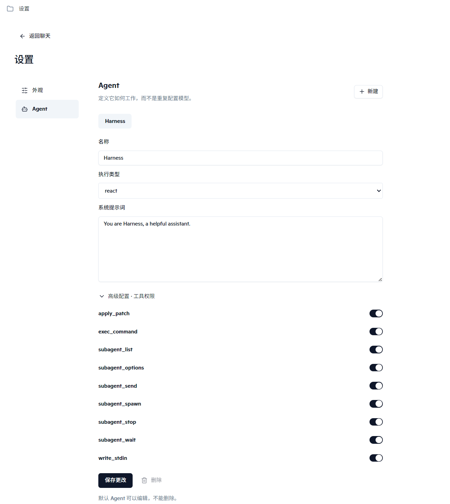
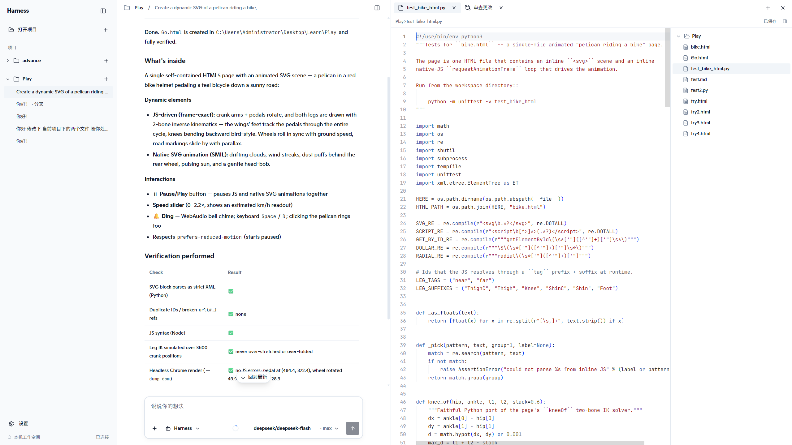
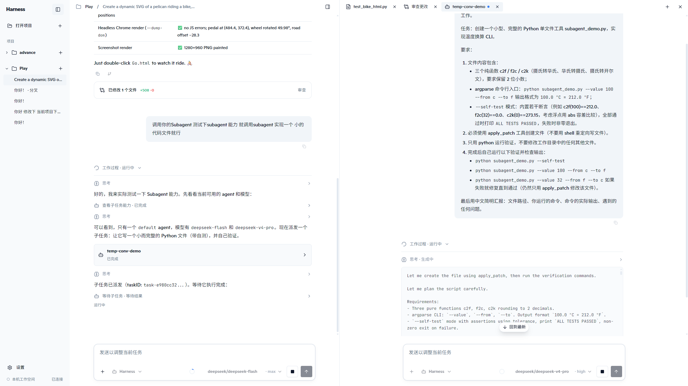

# EDITH-Harness

**面向软件开发的本地多 Agent 工作台。**

EDITH-Harness 将 Agent 运行时、文件编辑、终端、Diff 审查和 Subagent 协作放进同一个工作区。Go 后台同时支持浏览器 Web 和 Wails Desktop，业务消息保持 JSON-RPC 2.0。

## 架构

```text
cmd/harness / cmd/harness-desktop → backend 显式装配与逆序关闭

同一份 React（clients/web）
  ├─ 浏览器 → WebSocket ───────────→ appserver
  └─ Wails 窗口 → Stream → desktop/ ─→ appserver
                                     ├→ conversations → Runner → Loop / Tools
                                     └→ 公共服务 / Session
```

两种入口各自启动进程，共用 React 构建产物与后台业务，不能同时占用同一份用户数据。`appserver` 负责协议与连接，`conversations` 编排会话操作，`internal` 按领域归拢执行、数据与具体实现。没有 Host 服务表或 Product 层。

源码地图：[`internal`](internal/README.md) · [`appserver`](internal/appserver/README.md) · [`clients`](clients/README.md) · [`集成验收`](tests/integration/README.md)。

## 已实现

- **Agent 执行**：流式对话、思考与工具过程、Steer、停止、分叉、重连和后台恢复。
- **开发工具**：`exec_command`、`write_stdin`、`apply_patch`，统一通过本机 machine 服务执行。
- **文件工作区**：Monaco 编辑器、文件树、自动保存、外部变更同步和真实 Git Bash 终端。
- **Diff 审查**：按 Run 实时聚合文件变化，支持单文件查看、版本保护和撤销。
- **Subagent 协作**：多个子任务并行运行，各自拥有 Session、Run、工作过程和 Diff，并可在辅助面板中继续交互。
- **可扩展配置**：自定义 Agent、Skills、MCP、模型与思考档位按作用域组合生效。

## 界面

### Agent 设置

Agent 的提示词、执行类型和工具权限在同一处配置。



### 工作过程与编辑器

聊天区展示结果和执行过程，辅助工作区可同时打开文件、Diff 与终端。



### Subagent 工作区

从主 Agent 的子任务卡片打开独立工作页，实时查看进度、继续对话或审查修改。



## 运行

Web 需要 Go、Node.js、npm、Make；Desktop 还需要 Wails v3 CLI。Windows 还需要 Git Bash。

```bash
make run
make desktop-run  # wails3 dev：前端热更新，Go 改动后重启 Desktop
```

其他常用命令：

```bash
make build        # 构建前端并产出 .build/harness
make desktop-build # 经 wails3 build 产出 .build/harness-desktop
make agent-check  # 日常快速回归
make test         # 完整串行验收
```

Web 启动后访问 `http://127.0.0.1:8888/`。两端共用 `~/.harness`，同一时间只能运行一个后台；Desktop 不开放业务端口。

## 技术栈

Go · React · TypeScript · Vite · Wails v3 · WebSocket · JSON-RPC 2.0 · Monaco Editor · xterm.js · ConPTY
