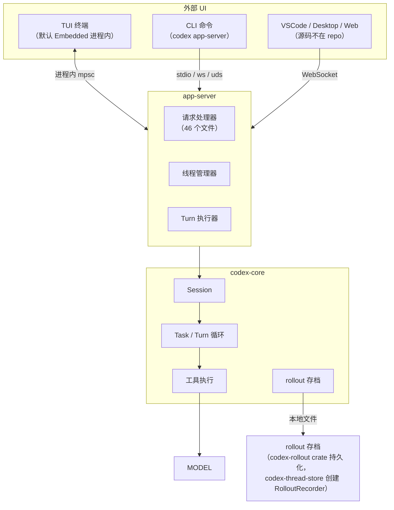
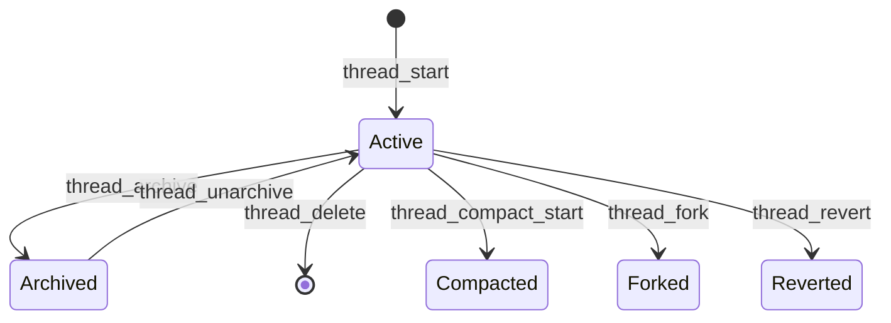
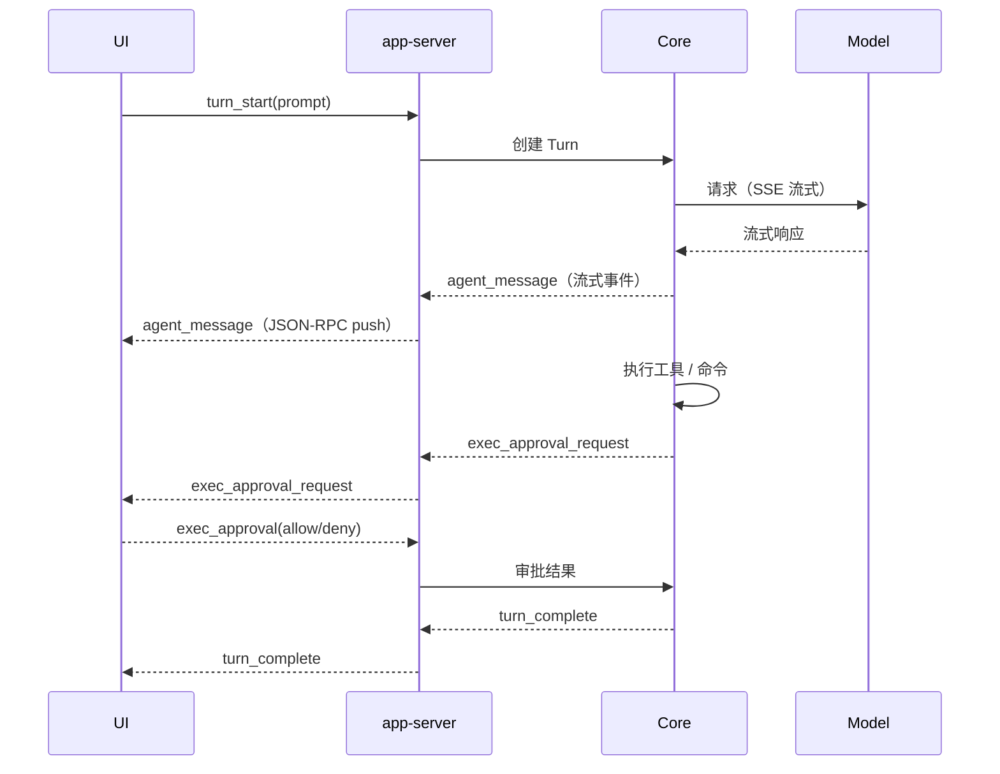
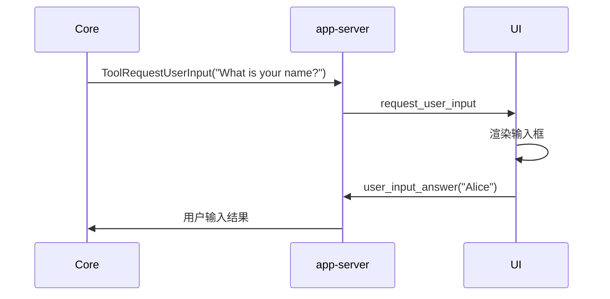
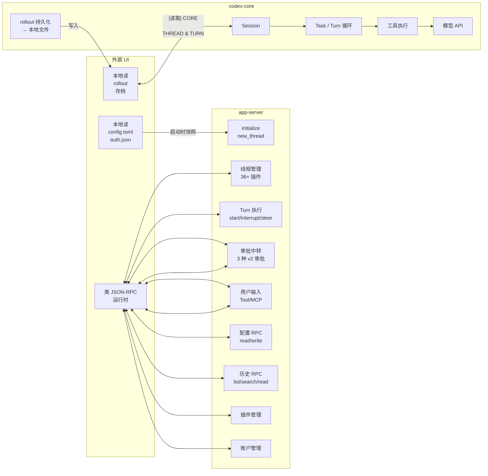

# App-Server 完全搞懂

> 基于 `reference/codex/codex-rs/` 源码的真实行为整理。

---

## 1. 它是什么

一句话：**app-server 就是 Codex 引擎的"服务端壳子"**。

`codex-core` 是纯大脑——有 `Session` / `Task` / `Turn` / 工具执行，但它**不直接跟 UI 通信**。core 依赖 `app-server-protocol` 知道协议类型定义，但不持有任何 UI。

app-server 干的事就是：

```
接收类 JSON-RPC 请求 → 调 core 的 API → 把 core 的事件推回客户端
```

> 注：app-server 的协议**不是严格 JSON-RPC 2.0**——它借鉴了 JSON-RPC 的结构（method / params / id），但**不发送** `"jsonrpc": "2.0"` 字段（源码 `app-server-protocol/src/rpc.rs` 模块注释明确说明）。

**本 repo 中**，所有 UI（TUI / CLI / VSCode / Desktop / Web）都通过 app-server 跟 core 交互。app-server 持有 core 实例，是生产环境中唯一直接调 core 的对象。



> 注：VSCode / Desktop / Web 客户端的源码**不在本 repo**，它们通过 WebSocket 连 app-server。

---

## 2. 它负责什么（8 大职责）

```
┌─────────────────────────────────────────────────────────────┐
│                    app-server 的 8 大职责                       │
├──────────────┬──────────────────────────────────────────────┤
│ ① 线程管理    │ 创建 / 恢复 / Fork / 归档 / 删除 Thread         │
│ ② Turn 执行  │ 启动 Turn / 中断 / 注入 / 设置模型              │
│ ③ 审批中转    │ 命令执行审批 / 文件改动审批 / 权限审批           │
│ ④ 用户输入    │ Tool 要输入 / MCP Elicitation                  │
│ ⑤ 配置读写    │ config.toml 管理 / 模型目录 / 诊断              │
│ ⑥ 历史浏览    │ Thread 列表 / Turn 列表 / 回放 / 搜索           │
│ ⑦ 插件管理    │ 插件安装 / 搜索 / 同步                          │
│ ⑧ 账户管理    │ 登录 / 认证 / 账户状态                          │
└──────────────┴──────────────────────────────────────────────┘
```

下面逐个说。

---

## 3. 职责 ①：线程管理（Thread Lifecycle）

这是 app-server 最核心的职责。一个 Thread 就是一个"对话会话"。

**支持的操作（`thread_processor.rs`，6188 行，36 个 pub(crate) async fn）：**

| 操作 | 含义 |
|---|---|
| `thread_start` | 新开一个对话 |
| `thread_resume` | 恢复一个历史对话 |
| `thread_fork` | 从某个历史点分叉出新对话 |
| `thread_archive` | 归档对话 |
| `thread_unarchive` | 取消归档 |
| `thread_delete` | 永久删除（独立文件 `thread_delete.rs`，160 行） |
| `thread_compact_start` | 压缩上下文 |
| `thread_revert` | 回滚到某个历史点 |
| `thread_set_name` | 给对话改名 |
| `thread_memory_mode_set` | 设置 memory 模式 |
| `thread_unsubscribe` | 取消订阅 |
| `thread_metadata_update` | 更新元数据 |
| `thread_section_move` | 章节排序 |
| `memory_reset` | 重置记忆 |
| `thread_rollback` | 回滚 |
| `thread_search` | 搜索 |
| `thread_shell_command` | Shell 命令 |
| ... 共 36 个 | |



---

## 4. 职责 ②：Turn 执行（Turn Execution）

一个 Thread 内部，核心循环就是 Turn。app-server 负责"指挥 core 跑 Turn"。

**支持的操作（`turn_processor.rs`，1672 行，13 个 pub(crate) async fn）：**

| 操作 | 含义 |
|---|---|
| `turn_start` | 启动一轮对话（用户的 prompt 进去） |
| `turn_interrupt` | 中断当前 Turn |
| `turn_steer` | steering——在 Turn 运行中注入影响 |
| `turn_settings_update` | 动态改模型 / reasoning effort |
| `thread_inject_items` | 向正在运行的 Turn 注入消息 |
| `thread_realtime_start` | 开始实时语音对话 |
| `thread_realtime_stop` | 停止实时语音 |
| `thread_realtime_append_audio` | 实时语音追加音频 |
| `thread_realtime_append_text` | 实时语音追加文本 |
| `thread_realtime_append_speech` | 实时语音追加语音 |
| `thread_realtime_list_voices` | 列出可用语音 |
| `review_start` | Review 模式 |



---

## 5. 职责 ③：审批中转（Approval Relay）

当 core 想执行危险操作（跑命令 / 改文件 / 申请权限），它**不能直接问 UI**——core 不持有 UI 引用。

流程是：

```
core → app-server: "我需要执行这个命令，请审批"
app-server → UI: exec_approval_request（JSON-RPC push）
UI → app-server: exec_approval(allow/deny)
app-server → core: 审批结果
```

**3 种实际处理的审批类型（v2）：**

| 审批类型 | 协议方法 | 含义 |
|---|---|---|
| `CommandExecutionRequestApproval` | 命令执行审批 | 模型想跑 shell 命令 |
| `FileChangeRequestApproval` | 文件改动审批 | 模型想改文件（apply patch） |
| `PermissionsRequestApproval` | 权限审批 | 模型要额外文件系统权限 |

**2 个 legacy 类型（v1，协议中定义但 app-server 无 handler）：**

| 审批类型 | 说明 |
|---|---|
| `ApplyPatchApproval` | v1 协议 stub，app-server 未实现 |
| `ExecCommandApproval` | v1 协议 stub，app-server 未实现 |

> 注：实际的审批中转代码在 `bespoke_event_handling.rs`（2189 行），不在 `command_exec_processor.rs` / `process_exec_processor.rs` / `windows_sandbox_processor.rs`——后三个文件负责**执行**命令/进程，不负责审批中转。 |

---

## 6. 职责 ④：用户输入（User Input）

除了审批，core 运行时还可能问 UI 要**自由输入**：

| 场景 | 协议方法 | 含义 |
|---|---|---|
| `ToolRequestUserInput` | Tool 要用户输入 | 模型调的工具需要问答 |
| `McpServerElicitationRequest` | MCP Elicitation | MCP 服务器向用户要参数 |



---

## 7. 职责 ⑤：配置与诊断（Config & Diagnostics）

app-server 还管**配置的读写**：

| 操作 | 含义 |
|---|---|
| `config_read` | 读当前配置（合并了所有 layer） |
| `config_write` | 写配置到 `config.toml` |
| `config_errors` | 返回配置校验错误 |
| `diagnostics` | 运行环境诊断 |
| `feedback` | 发送用户反馈 |

---

## 8. 职责 ⑥：历史浏览（History Browsing）

Thread 存盘后，UI 可以"浏览历史"：

| 操作 | 含义 |
|---|---|
| `thread_list` | 列出所有 Thread |
| `thread_read` | 读某个 Thread 的详情 |
| `thread_turns_list` | 列出 Thread 的所有 Turn |
| `thread_items_list` | 列出 Turn 的所有消息项 |
| `thread_search` | 在历史中搜索 |
| `thread_sections` | 读 Thread 的章节划分 |
| `thread_timeline_list` | 读时间线视图 |

> 注：历史存档由 `codex-rollout` crate 持久化到本地文件，`codex-thread-store` 负责在创建/恢复/回滚 thread 时创建 `RolloutRecorder`，不是 app-server 直接保存的。

---

## 9. 职责 ⑦：插件管理（Plugins）

`plugins.rs`（2398 行）负责插件生命周期：

| 子目录/文件 | 功能 |
|---|---|
| `plugins/local.rs` | 本地插件管理 |
| `plugins/reconcile.rs` | 插件同步 |
| `plugins/search.rs` | 插件搜索 |

---

## 10. 职责 ⑧：账户管理（Account）

`account_processor.rs`（1502 行）负责：

| 子目录/文件 | 功能 |
|---|---|
| `account_processor/rate_limit_resets.rs` | 速率限制重置 |
| `account_processor/bedrock_setup.rs` | AWS Bedrock 认证 |

---

## 11. 完整 API 一览（46 个请求处理器）

### 线程管理（13 个文件）

```
thread_processor.rs      6188 行  ← 主线程处理器（36 个操作）
thread_delete.rs          160 行  ← 线程删除
thread_lifecycle.rs       916 行  ← 线程监听器管理 / 后台卸载
thread_enrichment.rs      83 行   ← 线程丰富化
thread_fork_goal.rs       28 行   ← Fork 目标
thread_input.rs           37 行   ← 线程输入
thread_resume_redaction.rs 51 行  ← 恢复时脱敏
thread_sections.rs        234 行  ← 章节管理
thread_summary.rs         73 行   ← 线程摘要
thread_queue_processor.rs 336 行  ← 线程队列
thread_goal_processor.rs  530 行  ← Thread 目标 / 计划
thread_background_terminals_clean/list/terminate (in thread_processor.rs) ← 后台终端管理
```

### Turn 执行（2 个文件）

```
turn_processor.rs         1672 行  ← Turn 执行主处理器
turn_cost_worker.rs        (目录)  ← Turn 成本跟踪
```

### 审批中转（1 个文件）

```
bespoke_event_handling.rs  2189 行  ← 审批中转主处理（3 种 v2 审批）
```

### 配置与诊断（5 个文件）

```
config_processor.rs       814 行  ← 配置读写
config_errors.rs          35 行   ← 配置错误
diagnostics.rs            23 行   ← 诊断
feedback_doctor_report.rs 192 行  ← 反馈诊断
feedback_thread_index.rs  87 行   ← 反馈线程索引
```

### 历史浏览（5 个文件）

```
thread_turns_list (in thread_processor.rs)
thread_items_list (in thread_processor.rs)
thread_timeline_list (in thread_processor.rs)
thread_search (in thread_processor.rs)
thread_sections.rs        234 行  ← 章节管理
```

### 插件管理（1 个文件 + 子目录）

```
plugins.rs                2398 行  ← 插件管理
plugins/local.rs          ← 本地插件
plugins/reconcile.rs      ← 插件同步
plugins/search.rs         ← 插件搜索
```

### 账户管理（1 个文件 + 子目录）

```
account_processor.rs      1502 行  ← 账户 / 登录
account_processor/rate_limit_resets.rs
account_processor/bedrock_setup.rs
```

### 其他（21 个文件）

```
mcp_processor.rs          586 行  ← MCP 服务器管理
mcp_event_stream.rs       335 行  ← MCP 事件流
catalog_processor.rs      675 行  ← 模型目录
feedback_processor.rs     494 行  ← 用户反馈
apps_processor.rs         446 行  ← App 集成
projects.rs               402 行  ← 项目 / 工作区
environment_processor.rs  78 行   ← 环境变量
git_processor.rs          36 行   ← Git 操作
fs_processor.rs           221 行  ← 文件系统操作
search.rs                 134 行  ← 搜索
remote_control_processor.rs 184 行 ← 远程控制
remote_control_processor/ (子目录)
initialize_processor.rs   192 行  ← 初始化
marketplace_processor.rs  152 行  ← Marketplace
bedrock_auth.rs           157 行  ← Bedrock 认证
dynamic_tools.rs           ← 动态工具
persisted_resume_settings.rs 48 行 ← 持久化恢复设置
token_usage_replay.rs     111 行  ← Token 使用回放
```

---

## 12. 数据传输层

app-server 支持 **4 种传输方式**，对上层协议透明：

| 传输方式 | 文件 | 用途 |
|---|---|---|
| **WebSocket** | `transport/websocket.rs`（388 行） | 远程/多客户端连接，有鉴权 |
| **Stdio** | `transport/stdio.rs`（113 行） | 独立 app-server 二进制默认 |
| **Unix Socket** | `transport/unix_socket.rs`（214 行） | 本机其他客户端 |
| **Remote Control** | `transport/remote_control/` | 跨设备控制 |

> 注：`AppServerTransport` 枚举的第 4 个变体是 `Off`（禁用所有本地监听），不是一种传输。`Remote Control` 对应 `ConnectionOrigin::RemoteControl`，是连接来源分类，不是监听地址分类。TUI 的 Embedded 模式对应 `ConnectionOrigin::InProcess`，同样不是监听地址。

默认传输：`stdio://`

内部通道容量：通用 128，WebSocket 出站 32768，Embedded 事件消费层 unbounded。

---

## 13. 数据流总览



---

## 14. 总结

app-server 干了这些事：

```
┌─────────────────────────────────────────────────────────────┐
│  app-server = 协议网关 + 线程生命周期 + Turn 指挥 + 审批中转    │
│                                                             │
│  • 本 repo 的 UI（TUI / CLI）通过 app-server 访问 core         │
│  • app-server 是生产环境中唯一直接持有 core 的对象              │
│  • core 感知协议类型定义，但不直接通信                           │
│  • 46 个请求处理器 = app-server 的全部能力                       │
│  • 传输层 ws/stdio/uds/remote 对上层透明                      │
│  • 历史存档由 codex-rollout crate 持久化                        │
└─────────────────────────────────────────────────────────────┘
```

> 注：`thread-manager-sample` crate（独立二进制）也直接创建 `ThreadManager`，但它不是生产组件。

它的本质就是：**把 core 的"大脑能力"包装成"网络服务"，让任何前端都能遥控**。
