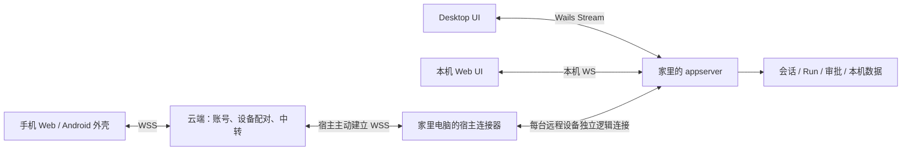

# Remote control：手机远控方向

状态：尚未实施。先夯实 Desktop 与 Web 基础，再接云端和手机。

## 目标与边界

手机使用共用 UI 的移动布局，远程查看会话、发送／插话／停止、处理审批；电脑和手机实时看到同一后台状态。首版先做手机 Web，稳定后再封装 Android App。

首版不把编辑器、终端、原生目录选择或本机 MCP OAuth 搬到手机；不做云端 Agent 执行、定时任务和手机后台系统通知。

当前 Desktop 将 appserver 放在 Wails 进程内，关最后窗口即退出；本机 Web 会另起后台，两者受数据锁限制不能同时运行。会话与审批已有订阅，会话列表还缺跨端推送；本机 `/rpc` 只允许回环访问。

## 心智模型

- **家里电脑是事实来源：**只运行一个拥有用户数据的 appserver。云端验证账号与设备、记录连接状态并转发消息，不运行 Agent、不保存会话正文。
- **前端是投影：**Web／Desktop／手机共用 React UI；客户端运行层统一处理 RPC、订阅、快照与重连，不另建“前端 appserver”。Desktop 本机仍用 Wails Stream，不需要让窗口改连 WS。
- **推送可恢复：**会话与审批沿用“订阅时取快照，随后接通知”；一端回答审批后，后台更新待办并推给两端。断线重取快照，不自动重发有副作用的操作。新交互先沿用“后台待办 → 双端展示 → 一端回答 → 双端更新”，不预建通用反向 RPC。
- **远程接入单独授权：**宿主主动连云，不开放家中公网端口；每台远程设备对应独立的 appserver 连接。认证与设备权限在接入前校验，远程可调用的方法在后端限制，不能只靠 UI 隐藏按钮。

## 开工顺序

1. **Desktop 基础：**实机验收启动、聊天、审批、重连和关闭行为；研究跨 Windows／macOS／Linux 的后台常驻方式。无论采用窗口进程驻留还是独立宿主，必须保持一个 appserver 和一份数据锁。
2. **Web 与多端基础：**让本机 Web／Desktop 接入同一个常驻后台；整理前端客户端运行层，补会话列表的快照与变更订阅，审批订阅提升到页面公共层；验证两端状态同步。
3. **云站点与中转：**提供账号登录、设备配对／撤销、宿主在线状态和 WSS 双向转发。云端按设备路由，每个远程客户端在宿主侧有独立逻辑连接；云断线不影响本机使用。
4. **手机入口：**共用 UI 做移动布局，先用手机 Web 验收聊天与审批，再考虑 Android App 外壳。

## 验收重点

两端同时看同一会话；手机回答后电脑审批窗口自动消失；另一端新建／归档会话后列表更新；掉线重连恢复快照；未配对或已撤销设备不能调用后台；Desktop 窗口关闭后，已启用远控的宿主仍在线。

后台常驻形态和云端登录方式留到对应阶段结合跨平台实测确定，不让远控实现反向规定现有本机 Web／Desktop 的传输。
