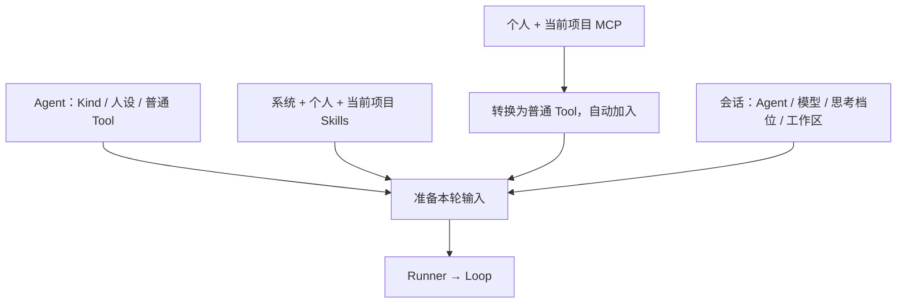

# Agent 与扩展的产品规则

已实施。本篇取代此前“Agent 选个人 Skill / MCP Tool”的产品规则。

## 谁管什么

- **Agent**：主要显示名称、Kind、人设（系统提示词）；普通 Tool 勾选放入默认折叠的「高级配置」。
- **Skills**：系统、个人、当前项目按作用域自动可用，不在 Agent 中勾选。提供摘要与路径，正文仍按需读取，不强制加载。
- **MCP**：个人配置全局可用，项目配置只在当前项目可用；Agent 不选 Server，也不选 MCP 内的小工具。
- **会话**：继续选择 Agent、模型、思考档位、工作区。



MCP 在执行层仍是普通 Tool；在配置来源上与 Agent 手选的普通 Tool 区分，不靠工具名字前缀猜来源。最终工具名单仍由 Runner / Loop 按现有调用路径使用。

## 本次调整

1. Agent 设置删除 Skills 与 MCP 工具选择。普通 Tool 清单移入默认折叠的「高级配置」，展开后勾选；继续沿用现有勾选方式，不改成禁用名单。
2. 所有作用域 Skills 使用同一套自动可用规则；Agent.Prepare 与 `/`、`$` 候选共用可用范围。
3. 个人 MCP 与项目 MCP 都自动加入本轮工具名单；现有同名覆盖和配置文件工具过滤规则保留，不增加 Agent 级筛选。
4. 兼容旧 Agent 数据：移除旧 Skills 选择与混入 Tools 的 MCP 选择，保留普通 Tool 选择；保存时写回新格式。
5. 同步 AGENTS、设计书、数据模型、STATUS 与旧 Skill 计划中受影响的说明，避免新旧规则并存。

Skills 的摘要与候选不以 read / bash 是否勾选为条件；移除现有读取工具门槛。正文仍由模型按需使用可用工具读取，不强制加载、不暗中补开工具；普通 Tool 配置由用户负责，不为缺少读取工具额外加拦截。提示词不应宣称未启用的工具可调用。

新增个人 MCP 不需要修改 Agent，但按现有配置加载时机生效，必要时重启；自动可用不等于热加载。

## 未来扩展页：只留方向，不实现

可放在设置中，统一管理：

```text
个人 Skills：按 Skill 开 / 关
个人 MCP：   按 Server 开 / 关
```

- 开关属于用户级扩展配置，对所有 Agent 生效，不存入 Agent 或 SessionSettings。
- 当前未提供开关时，已发现的个人 Skills、已配置的个人 MCP 默认可用。
- 未来在各自来源的可用列表生成之前过滤；关闭的 MCP 应不建立连接，而不只是隐藏工具。
- 开关只影响个人来源；项目配置是独立来源，同名项目项不受个人开关控制。
- 不提前新增扩展服务、空插件、页面、开关字段或热加载机制。

## 核心验收

- 不同 Agent 都能获得当前作用域的 Skills / MCP；普通 Tool 仍遵守各自勾选。
- Agent 未选 read / bash 时，Skill 摘要与候选仍可见，且不会自动启用这两个工具；普通 Tool 清单默认折叠在「高级配置」。
- 新增个人扩展不需要逐个修改 Agent；切换工作区不串入其他项目扩展。
- 旧 Agent 配置可正常打开、运行和保存；Skill 候选与实际可用范围一致。

本计划不实现扩展页、自动压缩或其他命令。
