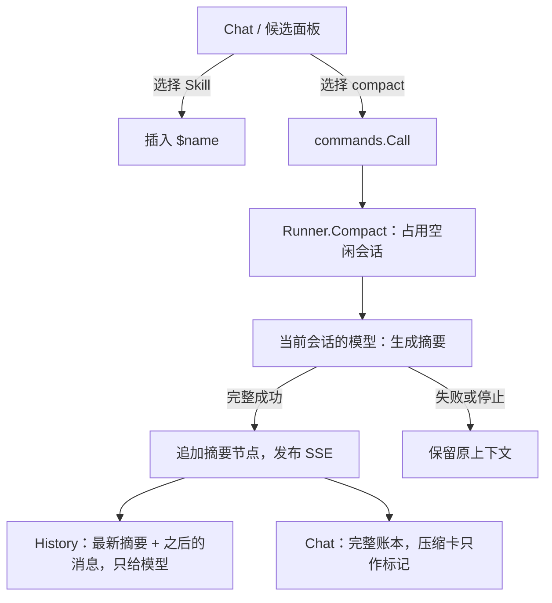

# Compact 与命令

实施计划，尚未实现。先读 `AGENTS.md`、`STATUS.md`。

## 流程



## 压缩请求

- 使用 SessionSettings 当前模型和思考档位，不另建压缩 Agent，不换 Kind、不新增 Loop。
- `Agent.Prepare` 提供提示词和工具名单；工具 schema 从 tools 取，有效历史从 Session 取，由 Runner 组装。
- 沿用当前工具定义和有效历史；摘要要求只加在这次请求末尾，不写进账本。保留目标、约束、已完成事项、关键结论和未完成工作。

```text
原请求：System + 工具定义 + 有效历史
压缩：  System + 工具定义 + 有效历史 + 摘要要求
```

尽量保持前缀一致以复用缓存；配置、Skills 或工具变化会影响复用，不保证全部命中。缓存由供应商处理，仍需发送完整内容，也仍受上下文窗口限制。

保留工具定义，压缩期间不执行工具。`llm.Input` 增加 `ToolChoice`；压缩传 `none`，平常聊天不传。缓存效果以服务端用量为准。

## 账本与运行规则

- 空账本或正在运行时拒绝；Runner 占用会话期间禁止普通发送和 Steer，允许 Stop。
- 只在完整成功且摘要非空时落账。看 `ChunkFinish.FinishReason`：仅 `stop` 且正文非空才 Append；`length`、取消、错误都不落账。
- 旧节点不删。追加普通助手消息，块标记 `Kind=summary`；不当 system 指令。
- `History()` 只取当前分支最新摘要及其后的消息，并把 `summary` 收成普通文本再交给 Loop / llm。`Entries()` 保留完整记录。LLM 不接收内部 summary 标记。
- 本版压缩全部有效历史，**不保留最近 N 轮**；再压缩的输入是旧摘要与后续消息。
- Chat 画完整账本；压缩卡只作标记。发给模型的才是 `History()`。分叉在压缩点前后都按所选历史生效。
- 沿用 Runner 的落账与 SSE 路径；摘要持久化成功才改变有效上下文，通知失败不回滚已落账节点。

## 归属

| 位置 | 职责 |
|---|---|
| `kernel/commands` | 平台命令登记处 B：Register / Get / List / Call |
| `plugins/kernel/commands/compact` | 填 commands；调用 Runner.Compact，不注册新服务 |
| `kernel/runner` | Compact 占用、调用 llm、停止、落账与通知 |
| `kernel/session` | 摘要节点与 History 投影 |
| `plugins/web/chat/composer/commands` | 使用 commands、chat，填 composer.suggestions |

命令选中立即 Call；Skill 仍插入 `$name`。Runner / Loop / Session 不认识 `/`。

## 实施与验收

1. Session 支持摘要；验证未压、压一次、再压、分叉及重启恢复。
2. 接入命令与 Runner.Compact；验证会话互斥、取消、空摘要、截断和错误不提交。
3. 接入 Chat 候选与压缩卡；验证 SSE 与刷新一致。
4. 同步设计书、数据模型与 STATUS 的已实现事实。

只做手动 compact；不做自动压缩、缓存管理系统、compact Loop 或其他命令。
