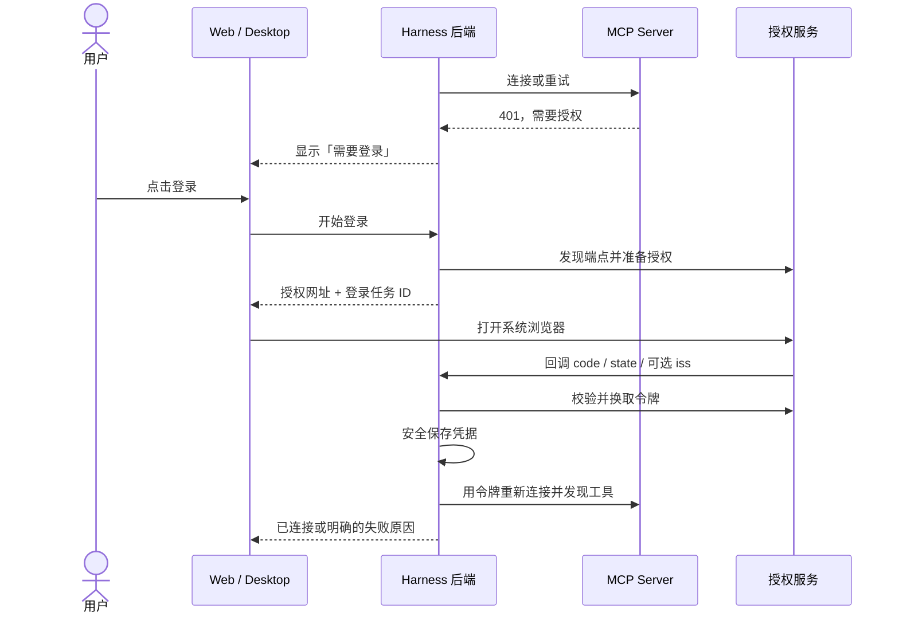

# Harness MCP OAuth 计划

## 一句话

给 **Streamable HTTP MCP Server** 增加「需要登录 → 用户主动授权 → 后端保存凭据 → 自动刷新」；Web 和 Desktop 共用后端授权流程。STDIO 仍从环境获取凭据。

```text
MCP Server ──401──> Harness 显示「需要登录」
用户点登录 ──> 浏览器授权 ──> 回调 Harness ──> 保存凭据 ──> 重新连接
```

术语：CIMD = 放在 HTTPS 上的「客户端名片」；DCR = 向授权服务现场注册客户端；PRM = MCP Server 公布的授权说明；`resource` = 要访问的 MCP 服务；`scope` = 授权范围；issuer = 发令牌的授权服务身份。

## 已核实的取舍

- 使用 Go MCP SDK 的 OAuth 授权码、发现、PKCE、换码与 HTTP 接入，但**不能把 SDK 当作完整的产品流程**：回调监听、登录任务、凭据存储和状态仍由 Harness 负责。先把现用 SDK v1.7.0 升至 v1.8.0；新版补了 OAuth 发现校验，并可用 `AcceptUnadvertisedIss` 接受与预期 issuer 相同、但未声明支持 `iss` 的回调。升级后仍要做协议用例验证。[Go SDK v1.8.0 发布说明](https://github.com/modelcontextprotocol/go-sdk/releases/tag/v1.8.0)、[SDK 授权配置](https://github.com/modelcontextprotocol/go-sdk/blob/v1.8.0/auth/authorization_code.go)
- 客户端身份按 **已有预注册身份 → CIMD → DCR → 提示手动配置** 选择。SDK 内部先试 CIMD，因此 Harness **只把选中的一种方式交给 SDK**。CIMD 需要真实可访问的 HTTPS 元数据文档；Harness 首版不托管该文档，支持用户填写自己的地址。DCR 是兼容途径，不能当成所有 Server 都支持的默认保证。[MCP 客户端注册](https://modelcontextprotocol.io/specification/2026-07-28/basic/authorization/client-registration)
- SDK 的 OAuth 客户端仍标为实验性；它检查 PKCE 元数据非空，但 Harness 还须确认支持 `S256`。授权与换码都带已验证的 MCP `resource`；回调必须匹配 `state`，有 `iss` 时必须匹配预期 issuer，授权服务声明会返回 `iss` 时则不可缺失。[MCP 授权规范](https://modelcontextprotocol.io/specification/2026-07-28/basic/authorization)、[安全要求](https://modelcontextprotocol.io/specification/2026-07-28/basic/authorization/security-considerations)

## 用户看到的流程



## 实施

1. **状态与入口**：区分「已保存、需要登录、登录中、已连接、失败、需增加权限」。`mcp/read` 只读现有状态，不连接项目 Server 或触发信任；新增开始登录、取消、退出登录及查询结果接口。MCP 领域先识别 401、`403 insufficient_scope` 与所需 scope，再只向 UI 返回脱敏状态；不能沿用目前一律显示「连接或工具发现失败」的错误路径。
2. **显式登录**：普通 Run 的连接和工具调用只使用已有凭据；遇到授权挑战只报告状态，不能调用会弹浏览器的 SDK `Authorize`。用户点击登录后，后端启动**独立后台连接任务**：先监听 `127.0.0.1`，SDK 收到 401 或需要增权的 403 后通过 `AuthorizationCodeFetcher` 交出网址，开始登录接口随即返回网址与任务 ID，后台继续等回调、换码和重连。取消、超时或失败都关闭监听并释放连接。
3. **回调与信任**：DCR 随本次随机端口注册回调地址；预注册和 CIMD 必须使用已登记的地址，不匹配时明确报错。任务绑定 Server、配置版本与回调路径；只接受对应任务的 code、state 和合法的可选 iss。项目 Server 在登录前须通过**设置页的显式配置确认入口**复用现有信任摘要与存储；不能伪造 Run 身份。配置变化时丢弃旧登录结果。
4. **凭据与刷新**：全局 Server 按全局作用域隔离；项目 Server 另按真实工作区路径隔离。两者还须绑定 Server 名、MCP 地址、已验证的 `resource` 和 issuer；重启后先重新发现并核对，再发送旧令牌。保存 DCR 的 client ID/secret、token endpoint、认证方式、scope 与轮换后的 refresh token；DCR 要声明 refresh grant。使用 SDK 的 `NewTokenSource` / `InitialTokenSource` 接入持久化，但刷新请求须额外携带 `resource`，不能直接用默认刷新。凭据保存在 `~/.harness/mcp/oauth/` 的独立文件中，Unix 限制为当前用户可读，Windows 用当前用户 DPAPI 加密；写入失败直接报错。预注册密钥也只进凭据存储，界面只显示脱敏状态；令牌、密钥不进入 `mcp.json`、RPC 或日志。
5. **运行边界**：新 Run 使用新连接；旧 Run 按现有引用规则收尾。`403 insufficient_scope` 显示「需增加权限」，用户下次主动授权时合并**已保存的**既有 scope 与新增 scope，并限制重试。退出登录清除本地凭据、阻止新鉴权，并使现存连接中该 Server 的后续调用失败。授权发现必须验证现代 PRM 与授权服务元数据，不接受 SDK 的旧版猜测端点回退；限制元数据 URL 和重定向的协议与目标，显式配置的本机 Server 可使用回环地址。

## 验收与边界

用本地假 MCP/授权服务覆盖：401 登录而普通 Run 不弹窗、取消/超时、错误回调、`iss` 有无声明、S256 缺失、三种注册方式、DCR 后重启刷新（含 `resource`）、轮换令牌、403 增权、配置变更、项目同名隔离及新旧 Run。真实 Server 再手工验收 Web 与 Desktop。代码完成后统一运行一次 `make agent-check`；UI 由用户运行 `make run` 截图验收。

首版只支持**本机 Web 与 Desktop**。当前 Web 后端监听回环地址；远程浏览器不一定能回到运行 Harness 的机器，远程访问需另设计回调地址或转发。[Web 入口](../../cmd/harness/main.go)
