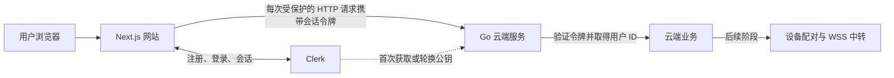

# Site 方向书

状态：网站前端与 Clerk 开发环境已初始化；云端 Go 服务和远控尚未实施。远控实施顺序见 [Remote control](../Remote-control.md)。

## 定位与结构

```text
site/
├─ frontend/   Next.js 网站，独立 npm 依赖与构建
└─ backend/    独立运行的 Go 云端服务，沿用仓库单一 Go module
```

两端独立构建、部署；暂不引入 npm workspaces，不搬动 Harness 现有 `clients/`。前端用 Clerk CLI 调用 Next.js 官方脚手架建立 TypeScript、App Router、ESLint、Tailwind，并绑定指定 Clerk 应用；开发密钥仅在未提交的 `.env.local` 中。保留简短的项目约束和检查命令，不堆叠模板。

## 身份与业务边界



- Clerk + Next.js 负责注册、登录、退出和会话界面；Go 不保存密码，也不实现登录流程。面向全球用户先用 Clerk 的简单开放注册。
- Next.js 调用受保护的 Go HTTP 接口时传 `Bearer` 会话令牌。Go 用 Clerk SDK 认证中间件验签、检查有效期，从**已验证的令牌**取得用户 ID；不能信任前端单独传来的 `clerk_user_id`。公钥缓存后在本地验证，不逐次向 Clerk 查询用户。
- Go 负责设备归属和远控权限。未来 WSS 在建连时认证，并把身份绑定到连接；长连接中转由 Go 承担，不放进 Next.js。云端不运行 Agent、不保存会话正文。

## 首版交付

首页与产品说明、真实可用的获取客户端入口、简短入门文档、登录注册和个人控制台。远控只保留明确的“开发中”入口，不展示虚假的设备状态。Go 首版只提供健康检查与受保护的当前用户接口，以验证两端身份链路；有设备数据时再引入持久化。

验收：注册／登录／退出可用；未登录不能访问控制台和 Go 受保护接口；登录后 Go 返回与当前账号一致的用户 ID；构建与检查独立于 Harness UI 通过。

参考：[Next.js 脚手架](https://nextjs.org/docs/app/api-reference/cli/create-next-app) · [Clerk Next.js 令牌](https://clerk.com/docs/reference/nextjs/app-router/auth) · [Clerk Go 验证](https://clerk.com/docs/guides/sessions/verifying)。
