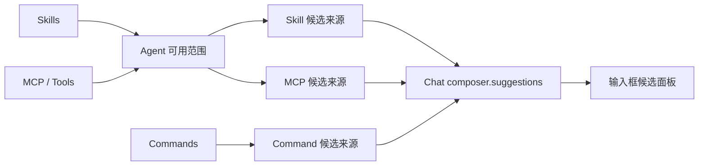

# Chat 输入候选计划

## 方向

Skills、Commands、MCP 保留各自的职责；Chat 只统一候选的查询与展示。



- Skills 负责发现；Agent 决定当前 Agent 可用的 Skill。
- Commands 负责定义命令；列出命令不经过 Agent。
- MCP 工具仍作为普通 Tool 交给 Agent；需要展示时转换为候选。
- 候选来源插件负责转换格式，并填入 Chat 的 `composer.suggestions` 登记处。
- Runner、Loop、Session 不认识输入候选。

## 统一候选

```go
type SuggestionSource interface {
    Prefixes() []string
    List(context) []Suggestion
}

type Suggestion struct {
    Name        string
    Description string
    Icon        Icon
    Scope       string
}
```

第一版由 `/` 或 `$` 打开 Skill 候选；`/` 以后还会合并 Commands 等来源，`$` 是 Skill 的原生前缀。

## Skill 规则

```text
系统  Harness 自带，所有 Agent 自动可用
个人  用户安装，必须先在 Agent 设置中选中
项目  当前工作区提供，所有 Agent 自动可用
```

第一份系统 Skill 是 `skill-creator`。它属于 Harness，与 Codex Skills 无关。

系统、个人、项目出现同名 Skill 时直接报错，不偷偷覆盖。

Skill 候选统一查询：

```go
agents.AvailableSkills(agentID, workspace)
```

`agents.Prepare` 和 Chat 共用这份结果，避免“界面显示可用，运行时却不可用”。

## 展示

```text
┌─────────────────────────────────────────────────────────────┐
│ 命令                                                        │
│  ◇ /new        新建当前项目中的对话                         │
│                                                             │
│ 技能                                                        │
│  ◇ Skill Creator      创建或修改 Harness Skill…       系统  │
│  ◇ PDF                创建、读取、渲染 PDF 文件…      个人  │
│  ◇ Plugin Development 新增或调整 Harness 插件…     Harness  │
└─────────────────────────────────────────────────────────────┘
```

- 每项一行：图标、名称、截断后的描述。
- Skill 最右侧显示 `系统`、`个人` 或项目名。
- Command 只显示名称和描述。
- 优先使用 `surface/web/ui` 受控图标；缺少时增加静态受控图标，不使用 Emoji 或运行时 SVG。

## 选择行为

```text
Skill         → 在当前光标处插入 `$skill-name`
UI Command    → Chat 直接处理
Agent Command → 交给 Runner 发起一轮运行
MCP           → 展示状态或打开面板；Tool 仍由模型调用
```

`$skill-name` 是普通 Prompt；不自动读取、不强制执行，也不修改 Agent 设置。消息卡在原位置把它显示成图标和名称。
