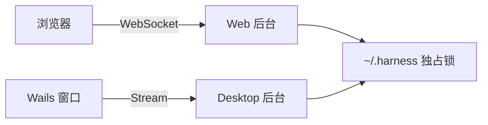

# Harness Desktop：第一步实施计划

## 目标

做出 **macOS 上可使用的桌面版**：复用现有 React 页面和 Go 后台，通过 Wails v3 Stream 完成聊天与通知，不开放桌面业务端口，保持完整 JSON-RPC 2.0 消息格式。[Wails Streams 文档](https://v3.wails.io/guides/streams/)

## 实施

1. 把现有入口的**显式服务组装**提取为一处，Web 和 Desktop 共用；保持当前启动失败清理与逆序关闭。
2. 为 appserver 开放通用连接入口。WebSocket 和 Wails Stream 分别做收发适配，复用同一套初始化、方法表、订阅和断线处理。前端只增加一个薄传输适配，把 Wails 收到的 `ArrayBuffer` 解码为现有 RPC Client 使用的文本。
3. 增加 Wails 桌面入口，加载同一份 React 构建产物。固定已核对的 Wails v3 Beta 版本；关闭最后一个窗口即退出，待连接关闭后清理后台。[Wails 生命周期文档](https://v3.wails.io/learn/lifecycle/)
4. Web 和 Desktop 共用 `~/.harness`，但启动前必须取得**跨进程文件锁**。占用时不启动第二个后台；Desktop 显示明确的占用提示。锁在所有服务关闭后释放，进程异常退出后由操作系统释放。首版提供运行和构建命令，暂不做签名、安装包或托盘。

这一数据方案适合当前的文件存储。Codex 提供客户端连接同一 app-server 的方式；OpenCode 当前默认使用共享后台。Harness 以后也可沿通用连接入口演进，首版先不引入常驻服务的发现与管理。[Codex app-server](https://learn.chatgpt.com/docs/app-server) · [OpenCode CLI](https://opencode.ai/v2/docs/cli)

## 验证

- 针对连接入口和文件锁验证：请求与通知、重连、页面刷新、停止任务、超大消息、慢客户端、两个进程争用，以及退出后的重新启动。
- 完成后执行一次 `make agent-check` 和桌面构建；由你在 macOS 运行桌面版，验收聊天及现有页面交互。Windows 保留对应锁实现，真实界面验收留到 Windows 机器上。

**已定边界：** 首版是可聊天的 Desktop；优先 macOS；Web 与 Desktop 共享数据但不能同时运行；关闭窗口即退出。实施时同步更新现有 Desktop 方向文档，不覆盖当前其他未提交改动。
