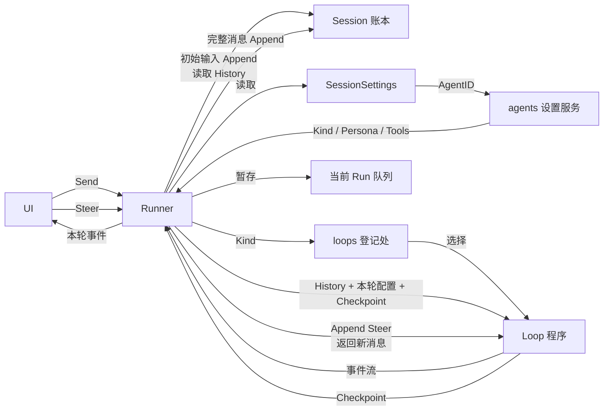

# Runner + Agent

## 三层

```text
Loop             开发者编译的运行范式：react / graph / plan-act
Agent            用户创建、实时修改的配置：Kind / Persona / Tools
SessionSettings  会话旁路配置：AgentID / Model / ReasoningEffort / Workspace
```

`loops` 是登记处（B），填入不同 Loop。Agent 设置由必装的 `agents` 插件管理；它 Resolve `loops`、`tools`，保存 Agent 时校验 Kind 和工具名。

## 一次 Run



Runner 每轮组合 Agent 设置和 SessionSettings，得到本轮只读配置；当前 Run 不受后续修改影响，下一次 Run 立即读取新值。

## 边界

- Loop 决定怎么思考；LLM Loop 可用 `llm`、`prompts`、`tools`。
- Runner 是唯一写账者：先写初始用户输入，顺序消费 Loop 事件后写完整消息。
- `Checkpoint` 是 Loop 与 Runner 的内部协作，不入账、不发 UI；它保证 Steer 不插进一组 Tool 调用中间。
- FollowUp：当前 Run 结束后同一 Session 再开 Run。Steer：当前 Run 未结束时进入其队列。
- UI 可在运行中让用户选 FollowUp / Steer；默认选择属于 UI 全局设置，不属于 SessionSettings。

## 前瞻验证：MCP

MCP 是服务提供者，不给 LLM 直接调用：

```text
MCP 服务 → 包装为普通 Tool → Agent 设置选择 Tool → Loop 调 tools
```

包装后的工具统一命名为 `mcp_<server>_<tool>`，例如 `mcp_github_create_issue`。这样多个 MCP 的同名工具不冲突；前端识别 `mcp_` 前缀后，可显示为「MCP / GitHub / create_issue」。

MCP 是否启用属于进程配置；Agent 设置不选择 MCP 服务，只选择它已经包装出来的 Tool。
