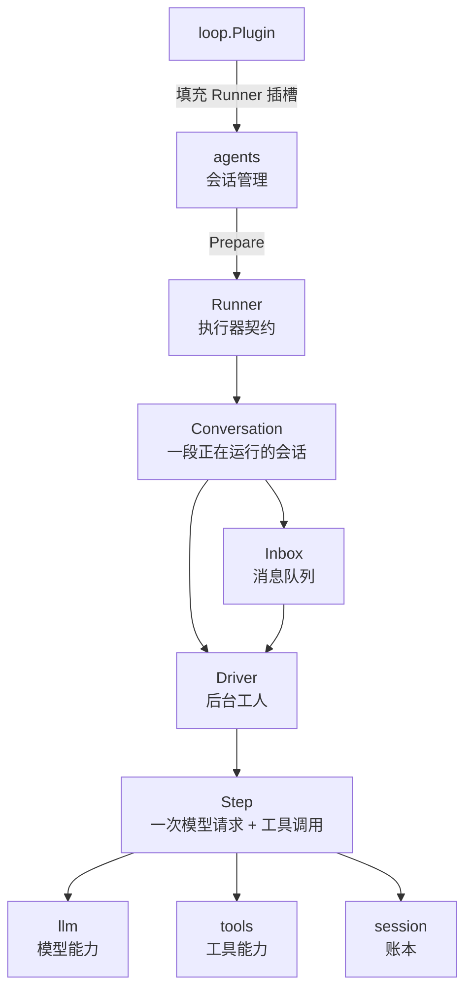

# loop

## 先记住一句话

```text
loop = 会话执行器

把一条消息跑成：
问模型 → 调工具 → 再问模型 → 没活后结束
```

## 它是不是插件？

【类型】插件

【它是什么】

`loop` 是 Agent 的执行器插件。它不负责创建会话，也不负责保存账本，只负责驱动会话工作。

【提供能力】

提供一个 `agents.Runner`，让 `agents` 能启动或恢复会话。

【使用能力】

使用 `llm` 请求模型，使用 `tools` 执行工具，使用 `session` 读写账本。

【填充插槽】

填充 `agents` 的 `Runner` 插槽。

```text
agents 预留 Runner 插槽
       ↑
loop   登记 Runner
       ↑
agents 用 Runner 准备 Conversation
```

## 极简心智模型



## 一次消息怎么跑

```text
用户消息
  ↓
Inbox 投递并记账
  ↓
Driver 被唤醒
  ↓
Turn 开始
  ↓
反复执行 Step
  ├─ 领取中途消息
  ├─ 从账本组装模型历史
  ├─ 加上系统提示和工具目录
  ├─ 请求 LLM
  ├─ 流式文字记入账本
  ├─ 记录完整回复
  ├─ 执行模型要求的 Tool
  └─ 有工具结果 → 再来一个 Step
  ↓
没有工具工作
  ↓
Turn 结束，Driver 等待下一条消息
```

## 最小伪代码

```text
启动：
  loop.Start(app)
    → 领取 llm 和 tools
    → 向 agents 登记 Runner

创建或恢复会话：
  agents.StartSession()
    → Runner.Prepare()
    → 创建 Conversation
    → Conversation.Start()
    → Driver goroutine 上线

Driver：
  等 Inbox 响铃
  标记 working

  while 还有待办消息：
    取一条消息
    开始 Turn

    while 模型还要求工具：
      开始 Step
      取 next-step 消息
      组装请求
      保存请求 Snapshot
      请求 LLM
      保存流式片段和完整回复
      执行 Tool
      结束 Step

    结束 Turn
  标记 idle
```

## 四个容易混淆的东西

```text
Session
  一本会话账本，保存身份和发生过的事实。

Conversation
  账本对应的运行门面，外部通过它发消息、取消、等待。

Driver
  Conversation 背后的一个 goroutine，真正按顺序干活。

Runner
  agents 和执行器之间的契约。
  loop 提供它，也可以被未来别的执行器替换。
```

## Turn 和 Step 的区别

```text
Turn = 处理一次用户输入的完整过程

Step = Turn 里面的一次模型请求
       加上这次请求触发的所有工具调用
```

```text
一个 Turn
  ├─ Step 1：模型说“我要调用工具”
  ├─ 执行 Tool
  └─ Step 2：模型看到工具结果后继续回答
```

## 两种消息入口

```text
SubmitFollowup(text)
  → next-turn
  → 开一轮新的 Turn

Steer(text)
  → next-step
  → 忙时进入当前 Turn 的下一步
  → 闲时成为新 Turn 的开头
```

所有投递都遵循：

```text
先写账本 → 再放进 Inbox → 再唤醒 Driver
```

## 取消是怎么工作的

```text
Conversation.Cancel()
  ↓
取消当前 Step 的 Go context
  ↓
LLM 和 Tool 收到 ctx.Done()
  ↓
停止当前工作
  ↓
已收到的模型文字保存为“被打断的回复”
  ↓
关闭 Step 和 Turn
```

如果工具已经真正开始执行但结果未知：

```text
账本保留 tool/start
不伪造 tool/result
恢复时标记为 unknown
不自动重跑
```

## 重启后怎么恢复

```text
读取 Session 账本
  ├─ deliver 没有 claim
  │    → 消息放回 Inbox
  ├─ tool/call 没有 tool/start
  │    → 记为 skipped，可以重试
  ├─ tool/start 没有 tool/result
  │    → 记为 unknown，不自动重跑
  ├─ chunk 没有 final
  │    → 固化为被打断的回复
  └─ 未结束的 Step / Turn
       → 补上结束记录
```

核心原则：

> 账本写了什么，就按什么恢复；不猜测，也不自动重做可能已经产生副作用的工具。

## 文件地图

```text
loop/
├─ plugin.go                 安装插件，登记 Runner
├─ runner.go                 实现 agents.Runner，准备 Conversation
├─ conversation.go           Conversation 门面和核心状态
├─ conversation_input.go     发消息、切换模型、领取消息
├─ conversation_state.go     状态、等待、取消、生命周期标记
├─ driver.go                 单 goroutine 主循环
├─ inbox.go                  next-turn / next-step 两个队列
├─ step.go                   一次 Step 的完整流程
└─ recover.go                根据账本恢复未完成工作
```

## 明确边界

```text
agents       管会话身份和 Conversation 生命周期
loop         驱动 Conversation 工作
session      保存账本和从账本计算历史
llm          路由模型请求
tools        登记并执行工具
Web UI       显示状态，不直接驱动 loop
```

所以，`loop` 的核心不是“保存数据”，而是这一条执行链：

```text
Inbox → Driver → Turn → Step → LLM / Tool → Ledger
```

## 阅读顺序

```text
plugin.go
  ↓
runner.go
  ↓
conversation.go
  ↓
driver.go
  ↓
inbox.go
  ↓
step.go
  ↓
recover.go
```

测试文件对应验证：正常回合、工具循环、排队、取消、关闭、崩溃恢复和并发边界。
