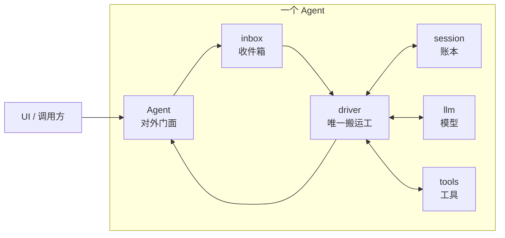
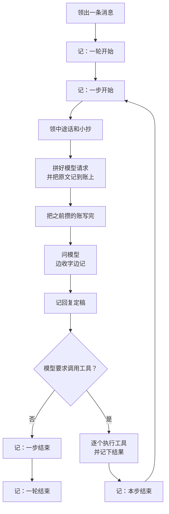

# Loop 模块说明书

## 一句话理解

`loop` 是搬运工：**领一条消息，问模型，按模型要求调用工具，再把工具结果交给模型，直到模型不再调用工具。**

它不负责判断答案好不好，也不实现模型和工具。它只负责把 `session`、`llm`、`tools` 串起来，并保证每一步都有账可查。

## 整体心智模型

每个 Agent 都有自己的收件箱、账本和一个搬运工。搬运工只有一个，所以同一个 Agent 的事情按顺序处理，不会同时跑乱。



可以这样记：

- `Agent`：窗口，外面的人只跟它说话。
- `inbox`：收件箱，消息先放这里排队。
- `driver`：唯一搬运工，负责不断领活和干活。
- `session`：账本，发生过什么都以它为准。
- `llm`：模型入口。
- `tools`：工具执行入口。
- `Roster`：Agent 名册，负责创建、查找和关闭 Agent。

## 三种消息有什么区别

| 方法 | 用途 | Agent 忙时 | Agent 闲时 |
|---|---|---|---|
| `SubmitFollowup` | 开一个新问题 | 排队，当前轮结束后再办 | 立即开新一轮 |
| `Steer` | 中途补一句或改方向 | 塞进当前轮的下一步 | 当作新一轮的开头 |
| `InjectMemo` | 塞一张只给模型看的小抄 | 下次问模型时带上 | 不唤醒 Agent，等下次有正事再带上 |

消息不是直接塞进内存就算完。顺序是：

1. 先记 `inbox/deliver`；
2. 记成功后才进收件箱；
3. 搬运工领出时记 `inbox/claim`；
4. 领出的普通消息才变成模型能看到的 `user/message`。

因此进程突然退出后，只要账上有“投递”但没有“领出”，这条消息就能重新放回收件箱。

## 一轮和一步

- **一轮（turn）**：从处理一条新问题开始，到模型不再要求调用工具为止。
- **一步（step）**：问模型一次，并处理这次回复里的全部工具调用。

一轮里可能只有一步，也可能反复多步：



问模型前会先把已经攒下的账写完。这样即使下一秒进程消失，重启后也知道事情断在了哪里。

## 取消时怎么处理

`Cancel` 只取消当前正在跑的这一步，取消信号会传给模型请求和工具。

- 模型已经吐出一部分文字：把收到的部分记成“被打断的回复”，不丢掉。
- 工具还没开跑：记成 `skipped`。
- 工具已经开跑，但没有拿到结果：账上不写假结果；重启恢复时补“结果不明”。

`WaitIdle` 会一直等到搬运工真正干完，并且待办队列已经清空。`State` 只对外报告 `idle` 或 `busy`。

## 崩溃后怎么恢复

恢复只看旧账，不相信已经丢失的内存状态。

| 旧账最后能证明什么 | 恢复动作 |
|---|---|
| 消息已投递、未领出 | 放回收件箱，继续处理 |
| 有工具调用、没有开始记录 | 补 `skipped`，说明工具没开跑 |
| 工具已开始、没有结果 | 补“结果不明”，禁止自动重跑 |
| 模型留下几段文字、没有定稿 | 合成一条被打断的回复 |
| 一步或一轮没有正常结束 | 补上结束记录 |

最重要的一条：**可能已经产生副作用的工具，恢复后绝不自动重跑。** 例如邮件可能已经发出，再跑一次就会重复发送。

## 对外入口

通常只需要接触下面这些：

```go
func submit(app *core.App) error {
    roster, err := loop.Get(app)
    if err != nil {
        return err
    }

    agent, err := roster.Create("assistant", loop.AgentConfig{
        Model:        "model-name",
        SystemPrompt: "你是一个助手",
    })
    if err != nil {
        return err
    }

    err = agent.SubmitFollowup("帮我处理这件事")
    if err != nil {
        return err
    }
    agent.WaitIdle()
    return nil
}
```

`loop.Plugin` 启动时需要三样东西已经装好：

- `"sessions"`：账本管家；
- `"llm"`：模型入口；
- `"tools"`：工具登记处。

插件启动后会登记 `"agents"` 能力。UI 和其他模块只需要通过这个能力拿到 `Roster`，不必知道搬运工内部怎么实现。

## 读代码的顺序

1. `plugin.go`：loop 怎么装进 App；
2. `roster.go`：怎么创建和管理 Agent；
3. `agent.go`：对外有哪些操作；
4. `inbox.go`：三种消息怎么排队；
5. `driver.go`：主循环怎么跑；
6. `recover.go`：重启后怎么收拾旧账。

读完这六个文件，就能掌握整个 loop 模块。
